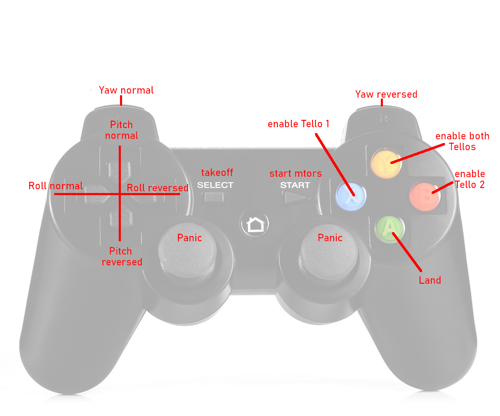

# Tello-Swarm-Gamepad
Two Tellos on one gamepad

# Overview
* Fly two Tellos with one Gamepad! 
* Optionally enable one of them or both 
* Optionally reverse channels for one of them 
* Let them fly identical or mirrored patterns 

# Requirements 
* Two Tello Quadrocopters (EDU or normal, see below)
* Gamepad (optional, you can also fly using the keyboard only) 
* A device (PC, Raspberry Pi, ...) running Python3 
* Python3, including libraries pygame, socket, threading, sys, time
* Tested on Linux Mint and Raspbian Buster
* WLAN router or second WLAN adapter(see below)

# How to connect 
You need to set up a swarm. Basically this can be done in one of the following ways: 

1) Tello EDU 
* Get two Tello EDU's, set them to station mode and connect them to a WLAN router
* Connect your PC or Raspi to the WLAN router 
* Obtain the IP addresses of the Tellos 
* Modify the script by 
  * overwriting the values for tello_address_1 and tello_address_2
  * removing the lines containing setsockopt

2) Normal Tello (Linux only) 
* Fit your PC or Raspi with an additional WLAN adapter 
* Locate the network names (On my Raspi it is wlan0 and wlan1, on Linux it may be something like wlxd03745aa6775) 
* If necessary, edit the script by overwriting the values for wlan0 and wlan1 
* Connect both Tellos (EDU or normal) to the two WLAN adapters  

# How to fly
Once you have connected your swarm and your gamepad, start the program. 
It will report the type of gamepad and the number of axes. It displays the answers from the Tellos which should be "1: ok" and "2: ok". 
Now you are all set and ready for takeoff. You can enter commands like "battery?" or "takeoff" via the keyboard and/or use the gamepad. 
You may check the batteries by typing "battery?" and get somethin like "1: 85" and "2: 69".   

The start and select buttons are used to start the motors ("old style") and to takeoff. With motors running, you can use the "up" stick to takeoff. So far, both Tellos always move synchronously and in the same direction.  

_Important_: Select a flying area with good light and little or no wind. The better the conditions, the more precisely the Tellos will move. Under unfavorable conditions, Tellos drift in different directions which makes maneuvering difficult. To get them synchronized again, select only one of them, hopefully the other one will stay in place. Steer the selected Tello to the desired position and re-enable both Tellos. This is done in the following way: 

The round buttons on the rigght side of the gamepad are used to select Tello 1, Tello 2 or both. Refer to the image showing the controls. Depending on your gamepad and operating system, the assignment of controls may differ. Let one Tello hover in place while letting the othe one fly around, then park the first one, let them fly togeter again, very much fun! 

To make it even more interesting, you can reverse the yaw, pitch and roll axes (up/down will always be the same for both Tellos) of Tello 2, letting the Tellos fly in different directions. Be sure to have an eye on both Tellos, don't let them collide or crash into something. 

The "B" button lands the selected Tello(s). Holding the button down for more than one second ends the program (Bug: You need to hit the enter key on the keyboard so the program really ends). The push buttons in the sticks issue an "emergency" command to both Tellos, so they both drop out of the air. 

Have tons of fun with your tellos! 
